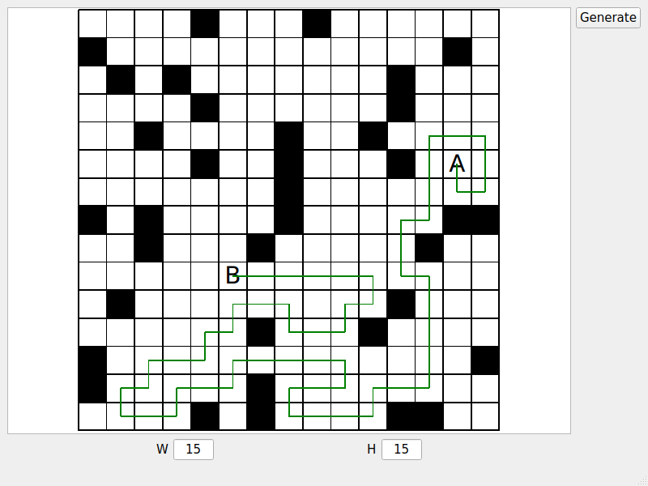

# Pathfind test assignment

The goal of this assignment is to create Qt application with following functionality:

- create matrix with given width and height;
- show path between cells A and B on the matrix (cells may be set either randomly or by user);
- exclude cells either manually or randomly from the path construction;
- open the window on the same position it was closed;

The implementation divided into two parts: a std::unordered_map-based graph with DFS router and a Qt GUI around it. A graph intentiously limited to (uint8_t x uint8_t) size due to simplicity reasons.

## Screenshot

<p align="center">
  
</p>

## Build & Run

```bash
$ make
$ make test
$ ./pathfinding_test_assignment
```

